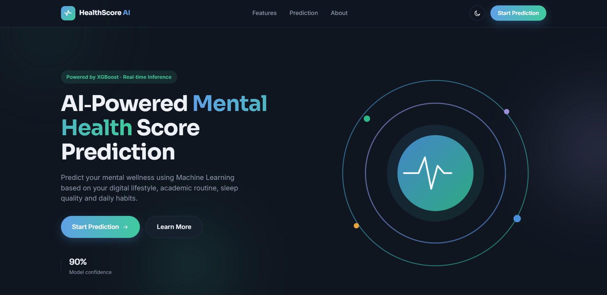
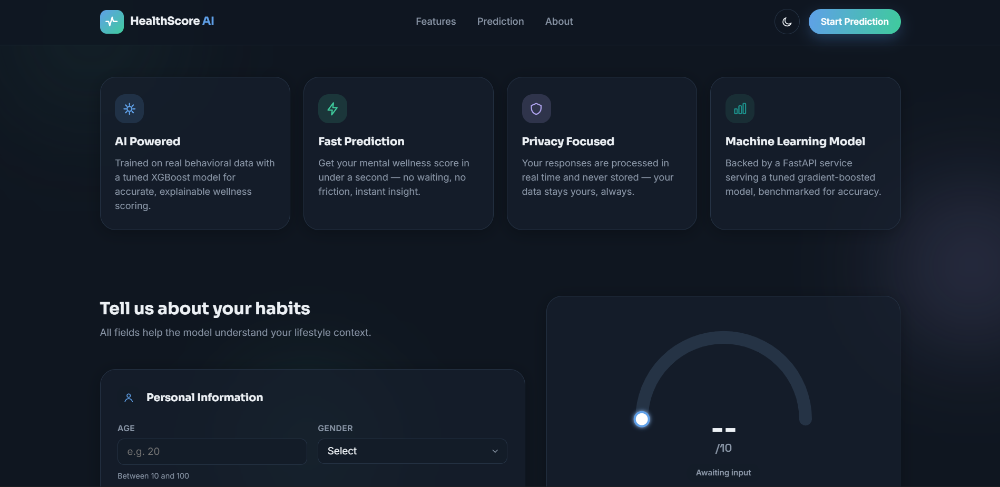
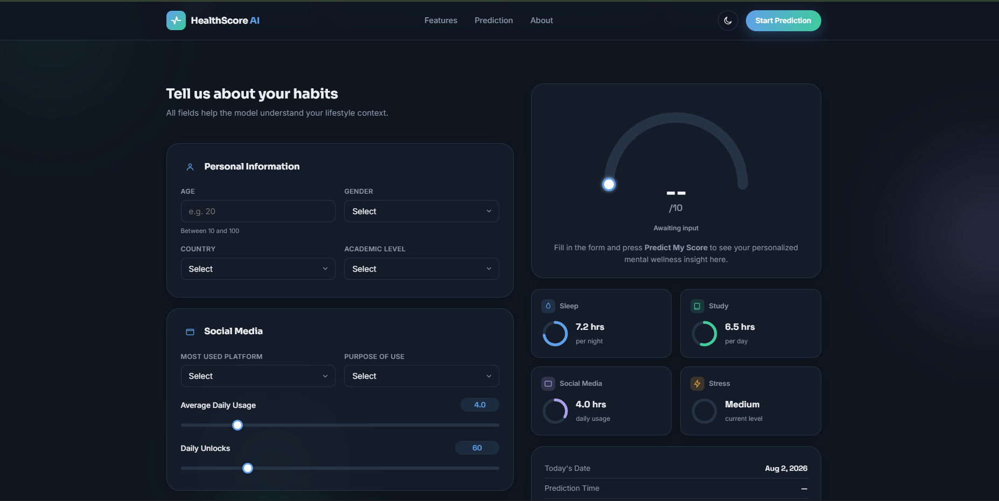
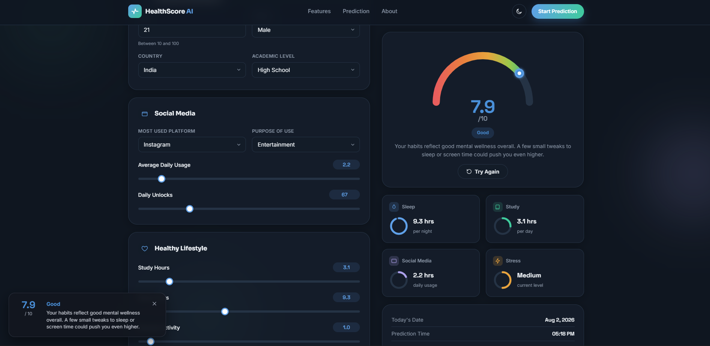
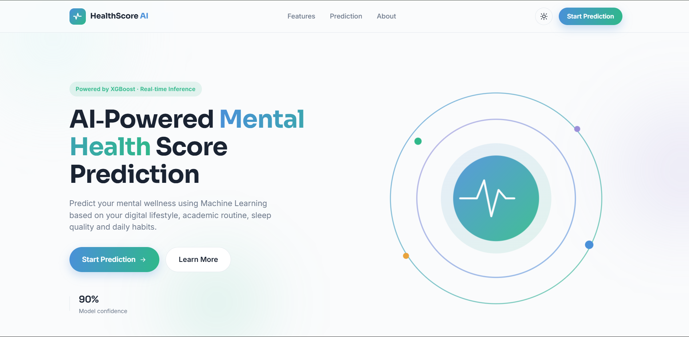
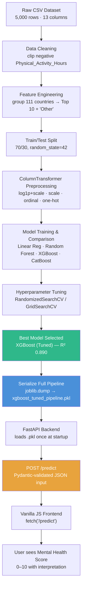
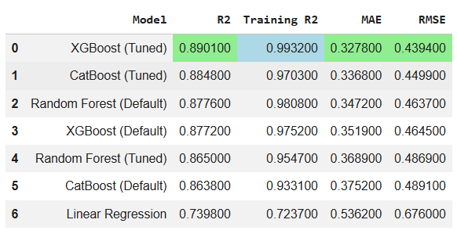

<div align="center">

# 🧠 HealthScore AI

### Predicting Student Mental Wellness from Digital Lifestyle Patterns

**A production-style regression pipeline — XGBoost + FastAPI + a hand-built vanilla JS dashboard — trained, tuned, and deployed end-to-end.**

[](https://www.python.org/)
[](https://fastapi.tiangolo.com/)
[](https://scikit-learn.org/)
[](https://xgboost.readthedocs.io/)
[](#)
[](#)
[](#)
[](https://railway.app/)
[](#-license)


</div>

---

## 📋 Table of Contents

- [Project Overview](#project-overview)
- [Demo](#demo)
- [Tech Stack](#tech-stack)
- [Project Architecture](#project-architecture)
- [Dataset](#dataset)
- [Model Training](#model-training)
- [Model Evaluation](#model-evaluation)
- [Installation Guide](#installation-guide)
- [How to Run](#how-to-run)
- [Author](#author)

## Project Overview

**HealthScore AI** predicts a student's **Mental Health Score** (a continuous value roughly between 3 and 10) from their social media habits, sleep, study time, physical activity, and self-reported stress level. It is framed and solved as a **regression problem**, not a classification one — the output is a real number, not a category.

### Why this problem matters

Excessive or poorly-managed digital habits are widely linked to reduced sleep quality, higher stress, and lower academic focus in students. Turning "vague lifestyle awareness" into a **quantified, personalized score** gives users something concrete to act on, instead of generic advice like *"use your phone less."*

### Target users

Students who want a quick, data-driven check on how their current routine (screen time, sleep, stress, study, exercise) is likely affecting their mental wellness — and a live, interactive dashboard to explore "what if I slept more / scrolled less" scenarios.

---

## Demo


**🔗 Live Demo:** https://healthscore-ai-production.up.railway.app/ 


### Home Page


### About Page


### Prediction Form

### Prediction Result

### Light / Dark Theme Toggle



---

## Tech Stack

| Category | Technology | Purpose |
|---|---|---|
| **Programming Language** | Python 3.12 | Core language for data processing, ML, and API |
| **Data Handling** | Pandas, NumPy | Loading, cleaning, transforming the dataset |
| **ML Library** | scikit-learn | Preprocessing pipeline, `ColumnTransformer`, Linear Regression, Random Forest |
| **Gradient Boosting** | XGBoost | Final production model (`XGBRegressor`, tuned) |
| **Gradient Boosting (benchmark)** | CatBoost | Comparison model during experimentation |
| **Visualization (EDA)** | Matplotlib, Seaborn | Distribution plots, correlation heatmap, boxplots |
| **Backend Framework** | FastAPI | REST API serving the trained pipeline |
| **Server** | Uvicorn | ASGI server running the FastAPI app |
| **Data Validation** | Pydantic | Request/response schema validation & typing |
| **Model Serialization** | joblib | Persisting the full sklearn pipeline as `.pkl` |
| **Frontend** | HTML5, CSS3, Vanilla JavaScript | Interactive form + animated result dashboard |
| **Experimentation** | Jupyter Notebook | EDA, feature engineering, model comparison |
| **Deployment** | Railway  | Cloud hosting with auto-deploy on `git push` |
| **Version Control** | Git & GitHub | Source control, CI trigger for Railway |

---

## Project Architecture

The project is split into two lifecycles that share **one artifact**: the trained pipeline (`.pkl` file). Everything in `Training/` happens once, offline. Everything in `Backend/` + `Frontend/` happens live, on every user request.




## Dataset

| Property | Detail |
|---|---|
| **Name** | Student Social Media And Mental Health Impact |
| **Source** | https://www.kaggle.com/datasets/dp2302/student-social-media-and-its-impact|
| **Rows** | 5,000 students |
| **Columns** | 13 (12 features + 1 target) |
| **Target variable** | `Mental_Health_Score` — continuous, range **3.6 – 9.4**, mean ≈ 6.23 |
| **Missing values** | **Zero** — confirmed via `df.isnull().sum()` |
| **Duplicate rows** | **Zero** — confirmed via `df.duplicated().sum()` |
| **Data quality issue found** | `Physical_Activity_Hours` had a **minimum of -0.4**, a physically impossible value (data-entry glitch) |

### Features

| Feature | Type | Notes |
|---|---|---|
| `Age` | Numeric | Range 18–24 in the training data |
| `Gender` | Categorical (nominal) | Male / Female |
| `Country` | Categorical (high-cardinality) | 111 unique values → engineered into `Grouped_country` |
| `Academic_Level` | Categorical (nominal) | High School / Undergraduate / Graduate |
| `Most_Used_Platform` | Categorical (nominal) | 12 platforms (Instagram, TikTok, YouTube, etc.) |
| `Purpose_Of_Use` | Categorical (nominal) | Networking / Education / Entertainment / News |
| `Avg_Daily_Usage_Hours` | Numeric | Mean 5.08 hrs/day |
| `Daily_Unlocks` | Numeric | Mean 171.5 unlocks/day |
| `Study_Hours` | Numeric (skewed) | Right-skewed — log-transformed before scaling |
| `Physical_Activity_Hours` | Numeric | Cleaned (negative value clipped to 0) |
| `Sleep_Hours_Per_Night` | Numeric | Mean 6.63 hrs |
| `Stress_Level` | Categorical (ordinal) | Low < Medium < High < Very High |

### Class / value imbalance

No class imbalance in the traditional sense (this is regression), but `Country` shows heavy skew: **111 unique values**, with the top 10 covering the majority of records and a long tail of single-occurrence countries — the direct motivation for the `Grouped_country` feature described below.


---

## Model Training

### Models compared

Six models were trained on the **identical preprocessing pipeline**, so the comparison is apples-to-apples:

1. **Linear Regression** — baseline
2. **Random Forest** (default hyperparameters)
3. **Random Forest** (tuned via `RandomizedSearchCV`)
4. **XGBoost** (default hyperparameters)
5. **XGBoost** (tuned via `GridSearchCV`) ← **final production model**
6. **CatBoost** (default hyperparameters)
7. **CatBoost** (tuned via `GridSearchCV`)

### Why XGBoost (Tuned) was selected

- Highest test-set **R² (0.8901)** among all 7 candidates
- Lowest test-set **MAE (0.3278)** and **RMSE (0.4394)**
- A training R² of 0.9932 vs. test R² of 0.8901 shows some overfitting margin, but it's still the best-generalizing model in the comparison — Random Forest (Tuned) actually generalized *better* in relative terms (0.9547 → 0.8650) but with a lower absolute test score, so it didn't win on the metric that matters for deployment: real-world accuracy
- Gradient boosting handles the non-linear stress/sleep/usage relationships found during EDA far better than the Linear Regression baseline (R² 0.7398), while training and predicting faster than CatBoost at comparable accuracy

### Final model persistence

```python
import joblib
joblib.dump(xg_best_pipeline, "xgboost_tuned_pipeline.pkl")
```

The **entire pipeline** is saved — not just the XGBoost model object — so the FastAPI backend never has to manually reimplement encoding or scaling logic at inference time.

---

## Model Evaluation





**How to read this:** the final XGBoost model explains **~89% of the variance** in students' mental health scores, and on average its predictions are off by only **±0.33 points** on a scale that runs roughly 3.6–9.4 — a practically small error for a wellness self-assessment tool.

---


---

**Field constraints (enforced by Pydantic):**

| Field | Type | Constraint |
|---|---|---|
| `age` | int | 10 ≤ age ≤ 100 |
| `gender` | enum | `Male`, `Female` |
| `country` | string | free text — anything outside the top-10 list is grouped as `"Other"` server-side |
| `academic_level` | enum | `High School`, `Undergraduate`, `Graduate` |
| `most_used_platform` | enum | 12 fixed platform options |
| `purpose_of_use` | enum | `Networking`, `Education`, `Entertainment`, `News` |
| `avg_daily_usage_hours` | float | 0 ≤ x ≤ 24 |
| `daily_unlocks` | int | x ≥ 0 |
| `study_hours` | float | 0 ≤ x ≤ 24 |
| `physical_activity_hours` | float | 0 ≤ x ≤ 24 |
| `sleep_hours_per_night` | float | 0 ≤ x ≤ 24 |
| `stress_level` | enum | `Low`, `Medium`, `High`, `Very High` |


## Installation Guide

### Prerequisites

- Python 3.10+
- pip
- Git

### Steps

```bash
# 1. Clone the repository
git clone https://github.com/USERNAME/HealthScore-AI.git
cd HealthScore-AI

# 2. Create and activate a virtual environment
python -m venv venv

# Windows
venv\Scripts\activate

# macOS / Linux
source venv/bin/activate

# 3. Install dependencies
pip install -r requirements.txt
```

---

## How to Run

```bash
# From the project root
uvicorn main:app --reload
```

Then open your browser at:

```
http://127.0.0.1:8000
```

The frontend, backend, and model are all served from this single origin — no separate frontend server or `.env` configuration needed for local development.

---


## Author

**Dharm Patel**

- GitHub: [@DharmPatel2302](https://github.com/DharmPatel2302/HealthScore-AI)
- LinkedIn: [Dharm Patel](https://www.linkedin.com/in/dharm-patel-2aa66427b/)

